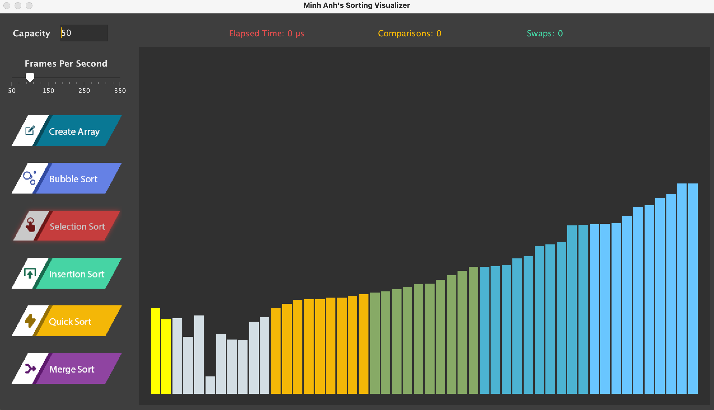

# Sorting Visualizer
Author: *Minh Anh Nguyen*  
A GUI application created by Java Swing to visualizing sorting algorithms.
1. Bubble Sortt
2. Selection Sort
3. Insertion Sort
4. Quick Sort
5. Merge Sort



## Installation
Copy all the files in the "config" folder to the root project or run this command  

```
ditto config .
```

### Opttion 1
Execute the Runner.sh script to compile and run the program

```
./Runner.sh
```

### Option 2
Open the MyVisualizer.jar directly by double-clicking on it.

### Option 3
Build the app by running tthe build.sh script

```
./build.sh
```
## How to Use
1. Input the array capacity by typing on the Capacity field
2. Click "Create Array" to generate the array
3. Adjust the speed of the visualization by dragging the FPS slider
4. Click the corresponding button to visualize an algorithm.
